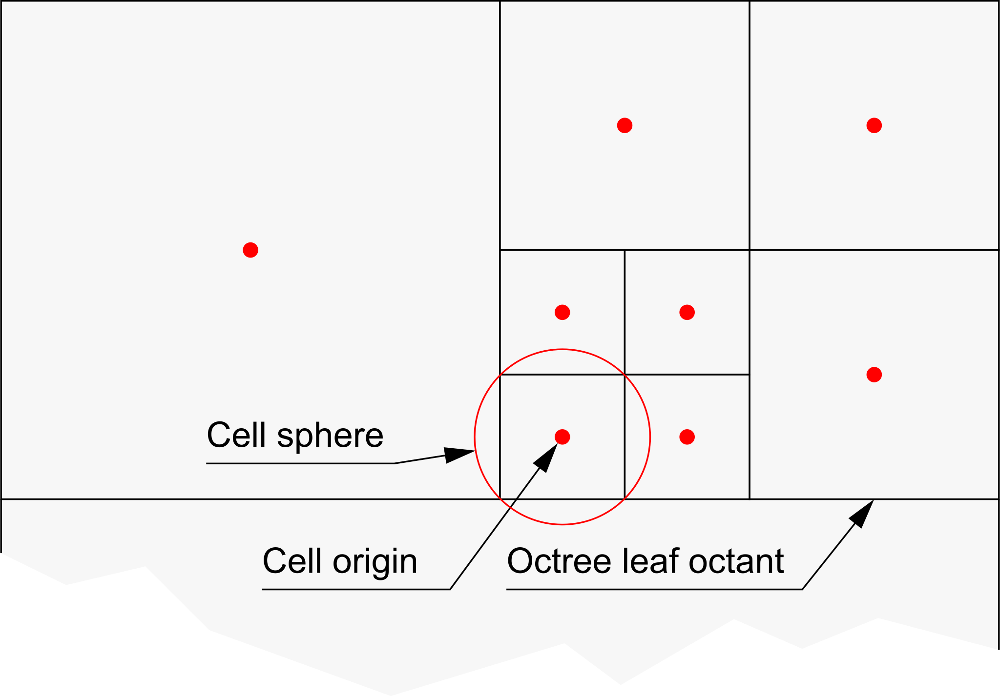
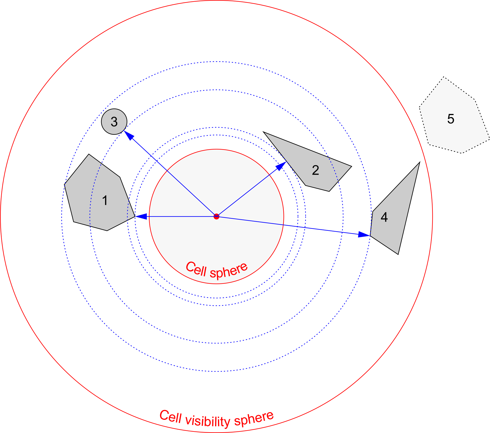
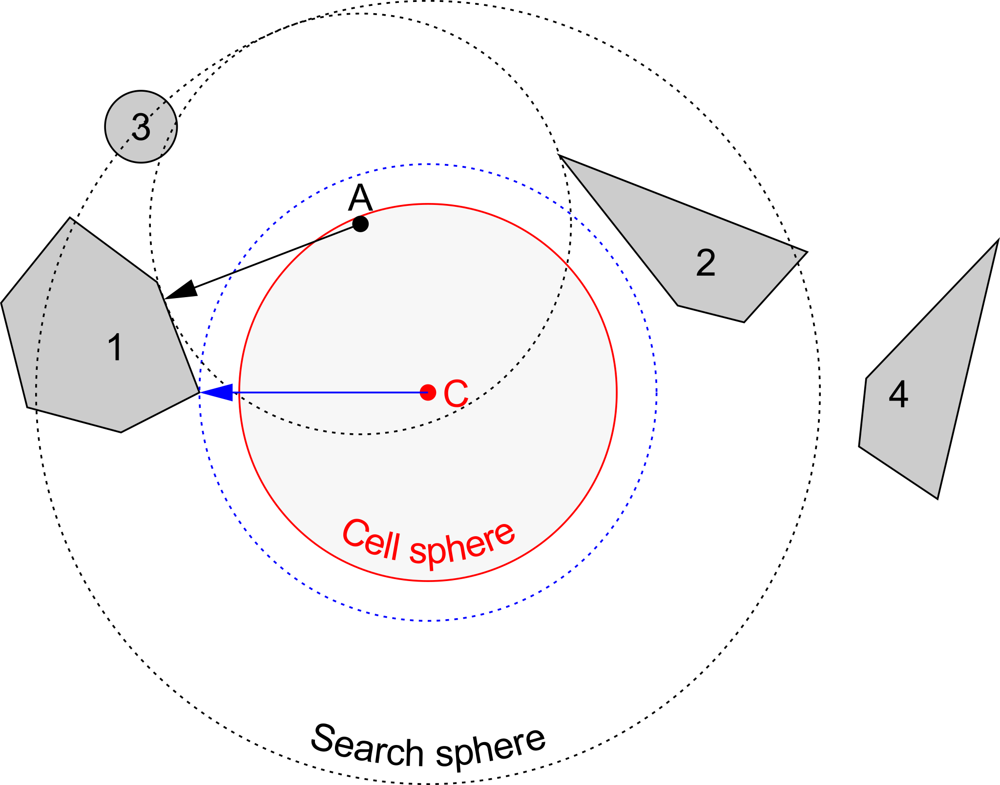
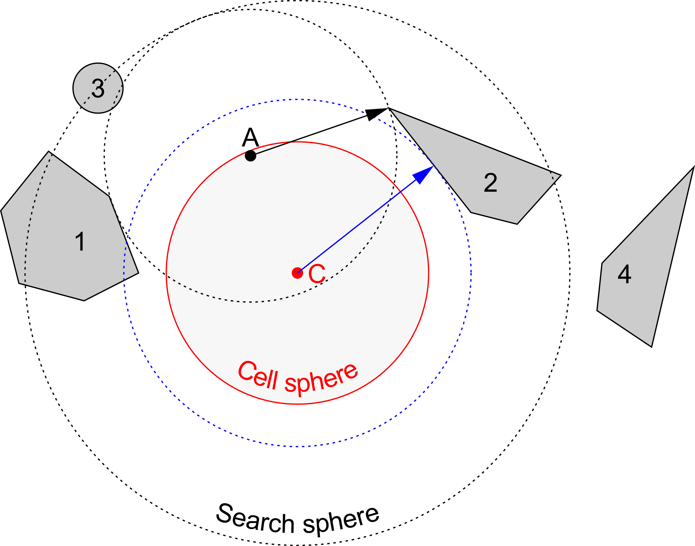

# Closest node lookup acceleration

## Problem

For a given point the closest node has to be found in a way that is faster than linear search.
For now a node can either be a sphere or an axis aligned rectangle with the plane being perpendicular to the vertical axis.
To be future proof, the acceleration structure should be able to handle any convex geometries.
This way it will make it possible to add slanted or polygon based nodes later.

## Acceleration structure

The method can be split into two parts:

- Finding the closest node to a point with the help of a list of nodes ordered by distance.
  The structure for this task will be called a cell.
  To reduce the number of nodes in a cell's list, the cell will have the form of a sphere.
  Nodes which are completely ghosted by other nodes will be left out.
  Completely ghosted by other nodes means it's impossible to find a point inside the sphere that is closest to the given node.

- A structure (Octree), that helps with finding the closest cell to a given point.
  Each leaf octant of the tree contains a cell which fully encloses its leaf octant.
  The octree doesn't need to be a cube, it just has to be made sure that the cell is a superset of the octant.

The nodes have to offer a function that returns the closest point to any given point.

### Cells

A cell contains a list of nearby nodes, sorted by the distance to the closest point of each node to the cell's origin (Blue arrows).
Nodes where the closest point is further away from center than `cellVisibilityRadius = firstClosestDistance + cellDiameter` can be omitted, as they cannot be reached from inside the cells sphere.

In the example below, node `5` will not be added to the list.
Node `4` is also not reachable, but it will be included as this type of ghosting can't be determined easily yet.

#### Finding the closest node with a cell

To find the closest node to a point `A` that is located inside the cell, you need to iterate over the cell's list of nodes until the "search sphere" radius is smaller than the distance to the closest point to the next node in the list.

An example:

1. You start with calculating the distance to the closest point of the first node (`1`) in the list.
The search sphere radius is the shortest distance of `A` to node `1` plus the distance of `A` to center `C`:

   

2. As long as the search sphere radius is larger or equal than the shortest distance from center `C` to the next node (`2`) in the list, you need to check that node too.
   If the shortest distance of `A` to node `2` is smaller than the previous distance (`A` to node `1`), node `2` should be stored as temporary result:

   

3. Same as step 2, but with node `3`:

   

4. The next node (`4`) is not within the search sphere, the search will stop here.
   As the shortest distance from `A` to node `3` is smaller than the previous distance, node `3` will be stored as result.

#### Building cells

TBD

### Octree

TBD
